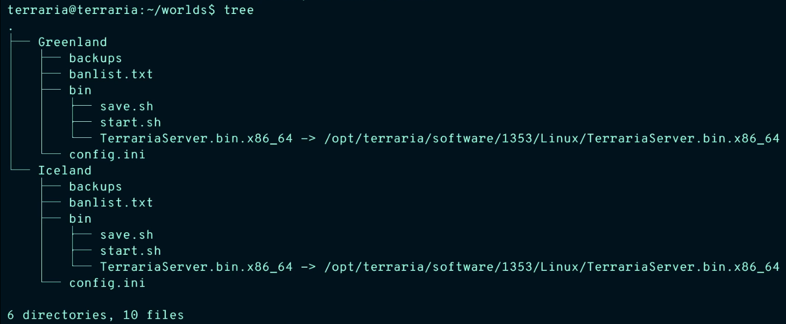

# Ansible Role: terraria_server

An ansible role to automate deployment of Terraria on linux hosts

Configures:
* a service user
* start scripts (executed in a screen session)
* save scripts (executed every 30 minutes)
* backups (rotated every 720 minutes by default)

<p align="center">
  
</p>

## Requirements
------------

* Linux target (this has been tested against Ubuntu 16.04 LTS)
* Ansible version 2.4.2.0 (others may work, but this version was used for testing)

## Role Variables

### Minimum Required Variables

You must define the version to deploy as this will obtained from the server file mirror.

```yaml
terraria_version: 1353
```

### Common Variables

Check out the [Getting Started](https://github.com/Komish/terraria_server/wiki/0.-Getting-Started) page for Terraria server-specific variables for a common use case (single server, single instance)

### All Variables

Documentation on all variables can be found in the [wiki](https://github.com/Komish/terraria_server/wiki/1.-Role-Variables)

## Example Playbook

Calling the role with minimum required `terraria_version` and a few configured values, relying on defaults for everything else.

```yaml
---
- hosts: servers
  roles:
  - role: terraria_server
    terraria_version: 1353
    world_name: "WorldOne"
    server_port: 7777
```
